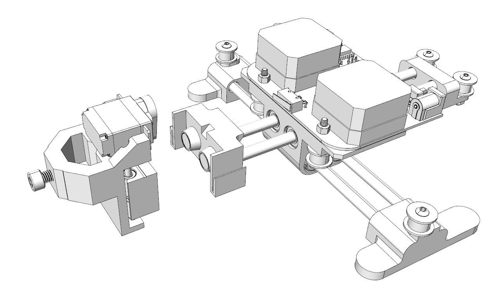

# X-Bot

这是一个自己设计的超迷你写字机器人，软件、电路、结构完全开源。

## 前言

关于相信机械臂大家应该都了解过，小到3D打印机、激光雕刻机，大到工厂里使用的工业机械臂，都是机械臂控制的典型应用。随着工业4.0时代的到来，机械臂这样一类最典型的“机器人”，正在逐渐服务于我们生活的方方面面。

X-Bot就是这样一个机械臂作品，确切地说它是我另一个AI项目的先导作品，由于之前看paper发现一个很有趣的条件生成式对抗网络（CGAN）模型，所以产生了一些脑洞准备动手结合硬件造一个AI灵魂画手。既然是画手，光有AI算法当然还不够传神，所以X-Bot就应运而生了，当时也考虑过好几种机械臂方案，最终选择了CoreXY结构作为X-Bot的设计方案。

## 关于机械臂

那么CoreXY结构是什么东西呢？

首先我们来了解一下目前比较流行的机械臂结构有哪些：

> 最经典的XYZ结构

这一类结构大家应该一眼就能看明白是怎么回事，简单说就是在X、Y、Z三个方向上都是独立的直线运动，虽然形式有多种比如图中的第一种被称作龙门式，一般在雕刻机领域用的很多；而第二种在比较追求小型化的3D打印机上经常可以看到其身影。

XYZ结构的好处就结构非常简单，控制也很简单，由于三个方向上的运动都是解耦的（一个方向的运动不会影响到另一个方向），而且相对来说由于是纯线性驱动，其运动精度会比较容易控制。

> DELTA结构

由于我们身处三维空间，因此来说只要是三个*线性独立*的向量都可以用来表征空间中一个唯一的坐标，对应于机械臂中，就是说只要我有三个可以精确驱动控制的电机，我就可以玩出各种花样让一个机械臂精确地运动到某一点。在XYZ结构中，X、Y、Z三个电机的地位并不是对等的，而DELTA结构则以一种很巧妙的方式完全对称地放置三个电机，如上图所示。通过三根连杆两端一共六个万向关节的约束，DELTA机械臂的末端可以运动到三维空间中的任意一点（在行程范围内，且行程空间并不是和XYZ结构一样的一个立方体），这种结构的好处就是非常的**炫酷**，哈哈，其实几年前个人最早决定设计自己的3D打印机的时候，就对DELTA结构非常的热衷~由于杠杆效应，一般来说这类机械臂的运行速度都要比XYZ要快一些，同时由于非线性控制坐标解算需要消耗更多的计算资源，有兴趣的同学可以去了解一下DELTA结构到XYZ坐标的解算公式推导过程。

> 圆柱结构

提到XYZ大家首先想到的是笛卡尔坐标系，然而我们在中学的时候就学过另一种坐标系叫极坐标系，也就是用一个角度和一个长度就可以表征平面内一个点的坐标，而且其跟XY坐标的转换也很方便。那么讲极坐标系再加上一个Z轴的直线运动，就得到了这样的圆柱结构机械臂。这类机械臂在实际应用中见到的比较少，因为同为极坐标结构，下面这种SCARA结构有着更“拟人”的效果。

> SCARA结构

这一类机械臂的结构非常像人类手臂（虽然自由度差了很多，人手臂应该是7个自由度），优点很明显就是节省空间，缺点也很明显，由于远端的误差放大作用，对于电机角度控制的精度要求非常高，电机的一点点抖动传递到末端都可能造成很大的误差，因此在工业机械臂中，这类机械臂一般都是使用传动误差极小的谐波减速器。

> CoreXY结构

其实关于机械臂的结构还有各种各样，结构设计师们的脑洞实在是让人叹为观止，有兴趣的小伙伴可以去google一下国外的各种3D打印机作品，非常的有意思。这里只最后介绍一下X-Bot中采用的CoreXY结构。

与传统XY结构不同，CoreXY是一种仅使用一根同步带就可以控制末端在XY两个方向运动的结构，非常巧妙；但是和绝大多数其他结构一样，CoreXY这种结构也会有电机和限位开关分散分布，电路连接走线比较麻烦的缺点；于是在其基础上，X-Bot改变了电机放置的位置，将其由两边放置改为中央放置，所有的电路板和电机集中布置，结构更紧凑。

## 电路设计篇

电路很简单就是一个STM32的最小系统，电机驱动直接使用了一体式的驱动器，可以tb搜索一下有很多。蓝牙模块使用的是HC-05，12V供电就行。

## 固件篇

直接移植了Arduino上面很成熟的grbl固件到STM32上，参数都已经设置好了，也把坐标转换函数从XY改为了CoreXY，keil直接烧录就能用了。

## 其他

待更新。